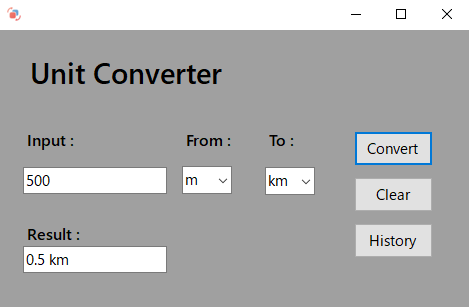
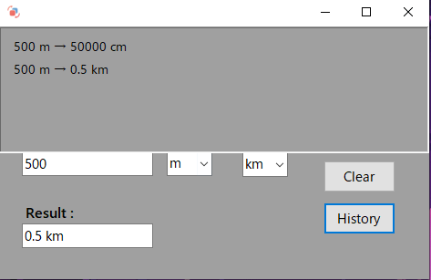

<h1 align="center">📏 Unit Converter</h1>

A simple C# Windows Forms application to convert between meters, centimeters and kilometers with history tracking and some panel animations

---

<h2 align="left">About this project</h2>

✨ Built by a college student learning C# and Windows Forms. 
📚 Purpose: Practice UI design, event-driven programming and conversion logic. 
🎯 Features: Conversion of m, cm, km, decimal results and history panel. 
🎲 Fun fact: This works..lmao

---

<h2 align="left">Features</h2>

- Convert **length units**: `m`, `cm`, `km`.
- Results displayed with **up to 4 decimal places**.
- **History panel** for tracking previous conversions.
- **Animated panel** for showing/hiding history.
- Clear input and selections with **Clear button**.
- Clean and minimal **Windows Forms UI**.

---

<h2 align="left">Form Layout</h2>

| Component       | Description                             |
|-----------------|-----------------------------------------|
| `inputTXT`      | Input number                             |
| `fromBX`        | Select unit to convert from              |
| `toBX`          | Select unit to convert to                |
| `resultTXT`     | Display conversion result                |
| `convertBTN`    | Perform conversion                        |
| `clearBTN`      | Clear input and selections                |
| `historyBTN`    | Open/close history panel                  |
| `panelHistory`  | Animated panel for previous conversions  |
| `slidertimer`   | Controls history panel animation         |

---

<h2 align="left">Screenshots</h2>

---

<h2 align="left">Usage</h2>

1. Enter a number in the **Input** field.  
2. Select **From** and **To** units.  
3. Click **Convert** to see the result.  
4. Click **History** to view past conversions.  
5. Click **Clear** to reset input and selections.

---

<h2 align="left">Technologies & Tools</h2>

  
  
  
  
  

---

<h2 align="left">Download & Run</h2>

Click the button below to download the latest version of the Unit Converter app.

  

